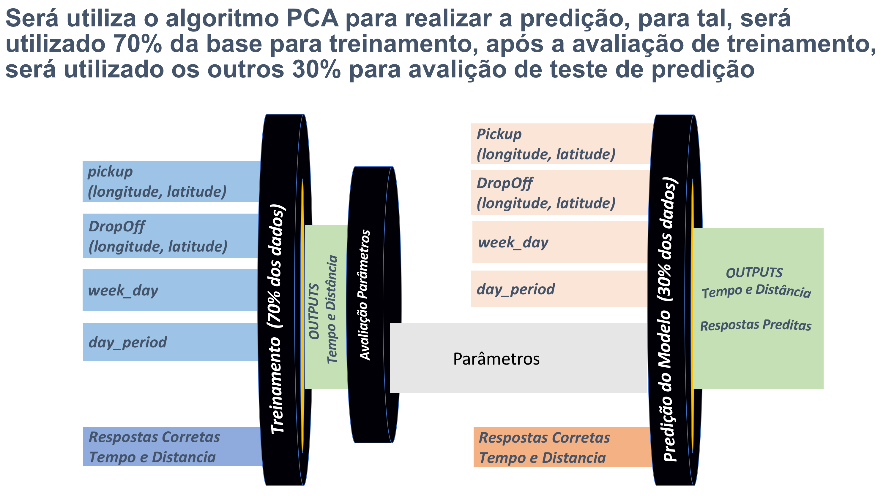

Análise "Corridas de táxi de NY" 
===========================================

> Alunos:

Nome                            | RM
------------------------------  | --------------------
Augusto Cesar Ribeiro Freire    | 330695
Marcelo Muzilli                 | 331136
Rafael da Silva Tomaz           | 330267
Renato Tavares da Silva         | 330659


---

Código Fonte 
===========================================

O código fonte do projeto está hospedado no Github no link:

[Projeto Final taxi GitHub ](https://github.com/rafaelstomaz/fiap_entrega_final_projeto_final_taxis_ny)

---


Introdução  
===========================================

Será utilizado como base para as análises o documento: __"R__Trabalho_final_parte_1.pdf"__ com informações sobre as definições do projeto e o dataset __"train.csv"__ fornecidos pelo professor, para o projeto através do portal do aluno.

O Dataset disponibilizado se refere a corridas de taxi de NYC, os campos do dataset:

- __id__ : chave única de cada corrida;
- __vendor_id__ : Código do provedor da informação;
- __pickup_datetime__ : Hora que a corrida se iniciou; 
- __dropoff_datetime__ : Hora que a corrida se encerrou;
- __passenger_count__ : Quantidade de passageiros na corrida; 
- __pickup_longitude__ : Longitude do início da corrida; 
- __pickup_latitude__ : Latitude do início da corrida; 
- __dropoff_longitude__ : Longitude do final da corrida; 
- __dropoff_latitude__ : Latitude do final da corrida;
- __store_and_fwd_flag__ : Indicada se o veículo armazenou o dado temporariamente antes de sincronizar com a central (ou seja, veículo sem conexão com a internet)
- __trip_duration__ : Duração da corrida, em segundos

---

Carregando variaveis e funçães necessrárias:  
===========================================

Para iniciar as análises será carregado algumas bibliotecas (pacotes) e dados de dependencias, conforme abaixo que se encontram no arquivo VariaveisGlobaisEFuncoesGlobais.R

```{r message=FALSE, warning=FALSE}
# Carrega o arquivo necessarias em memória
source("VariaveisGlobaisEFuncoesGlobais.R")

# Instala pacotes adicionais e pacotes necessários
install_missing_packages()

# Faz o Load dos pacotes necessários para utilizar no projeto
load_packages()

# Faz Load dos arquivos necessários no projeto
load_file_dependenncies()
```

---

Dados do Dataset  
===========================================

```{r message=FALSE, warning=FALSE}
  head(ds_taxi_train,5)
```

---

Summary do Dataset  
===========================================

```{r message=FALSE, warning=FALSE, out.width=12}
summary(ds_taxi_train) 
```

---

Mapa de NYC (New York City)  
===========================================

```{r message=FALSE, warning=FALSE, fig.height = 8, echo=FALSE}
  get_map(location = "new york city", zoom =  10, source = "google") %>%
    ggmap( extent = "normal", legend="bottomleft")
```

---

Enriquecimento  
===========================================

Para enriquecimento do projeto conforme orientações definidas na Parte 1 (enriquecimento).

```{r message=FALSE, warning=FALSE}
  data_wrangling_distance_calculate()
  data_wrangling_auxiliar_variables_definition()
  data_wrangling_quadrant_section_definition()
```

O Dataset será enriquecido com as seguintes variáveis:
[Diferença entre as duas métricas de distâncias Manhattan e Euclidiana ](http://www.improvedoutcomes.com/docs/WebSiteDocs/Clustering/Clustering_Parameters/Manhattan_Distance_Metric.htm)

- __distancia.manhattan__ : Cálculo da distância de manhattan de cada corrida em quilômetros (soma das diferenças entre x e y em cada dimensão.)
    - __distancia.manhattan.km__
    - __distancia.manhattan.m__
- __distancia.euclidiana__ : Cálculo da distância euclidiana de cada corrida em quilômetros (distância euclidiana, conforme definição de euclides, É como a soma da raiz quadrada da diferença entre x e y em suas respectivas dimensões).
    - __distancia.euclidiana.km__
    - __distancia.euclidiana.m__
- Segregação de dados de longitude e latitude em quadrantes, cada quadrante no máximo 20 metros quadrados:
    - __quadrante.pickup__
    - __quadrante.dropoff__

---

Enriquecimento (Continuação)  
===========================================

Para auxiliar nos gráficos será criado as variáveis:

- __trip_duration.minutes__ : tempo de dura??o em minutos (trip_duration / 60)
- __pickup_datetime__ 
    - __pickup_datetime.month__ (de 1 à 12)
    - __pickup_datetime.day__  (de 1 à 31)
    - __pickup_datetime.weekday__ (de Domingo à Sabado)
    - __pickup_datetime.hour__ (horario do dia variando de 0 a 23h)
    - __pickup_datetime.hour_period__ : periodo do dia (das 0:00:00 às 5:59:59 - madrugada, das 6:00:01 às 11:59:59 - manhã, das 12:00:00 às 17:59:59 - tarde, das 18:00:00 às 23:59:59)
- __dropoff_datetime__
    - __dropoff_datetime.month__ (de 1 à 12)
    - __dropoff_datetime.day__  (de 1 à 31)
    - __dropoff_datetime.weekday__ (de Domingo à Sabado)
    - __dropoff_datetime.hour__ (horario do dia variando de 0 à 23h)
    - __dropoff_datetime.day_period__ : período do dia (das 0:00:00 às 5:59:59 - madrugada, das 6:00:01 às 11:59:59 - manhã, das 12:00:00 às 17:59:59 - tarde, das 18:00:00 às 23:59:59)

---

Dados do Dataset após limpeza de dados  
===========================================

```{r message=FALSE, warning=FALSE}
  head(ds_taxi_train,5)
```

---

Summary do Dataset 
===============================

```{r message=FALSE, warning=FALSE}
  summary(ds_taxi_train) 
```
  
---

Análise básica de dados 
====================================

Análise exploratória inicial:

Faça uma análise exploratória indicando:

- Os principais horários das corridas
    - Distinção por dia da semana? 
    - Por dia do ano? 
    - Por hora do dia?
- As principais origens em função do horário
- Os principais destinos em função do horário
- O tempo médio da viagem em função do horário


__Para melhorar a análise inicial, estamos avaliando o tempo de corridas com maior número e iremos remover as que tiverem as com menos tempo ou tempos muito grandes de corridas (outliers).__

---

Variáveis do datase 
=============================

```{r message=FALSE, warning=FALSE}
  str(ds_taxi_train)
```

---

Summary do dataset por minutos de viagem
===============================

```{r message=FALSE, warning=FALSE}
  # Gerando valores por minutos
  data <- 
    ds_taxi_train %>% 
      count(trip_duration.minutes , sort = TRUE)

  # Summary dos dados
  summary(data)
```

---

Gráfico de análise de viagens por minutos
============================

```{r message=FALSE, warning=FALSE}
  ggplot(aes(x=trip_duration.minutes, y=n ), data=data) +
    geom_line(alpha = 0.5, size = 1, position = 'jitter') +
    scale_x_continuous(limits = c(0.2, 20),
       breaks = c(1, 2, 3, 4, 5,6,7,8,9,10,11,12,13,14,15,20)) + 
    scale_y_continuous() +
    geom_smooth(method = "lm") +
    xlab("Minutos de tempo de corrida") +
    ylab("Quantidade de corridas") +
    ggtitle("Gráfico de duração de viagem de corridas pelo modelo linear")
```

__Após analisar o gráfico acima, entendemos que o tempo com dados suficientes para análise com maior número de corridas estão com duração em minutos entre 4 e 13 minutos.__

---

Subset 
==================

> Filtrar o dataset para análise sobre um conjunto menor de dados, que contenha pelo menos 5000 observações.

Para a análise iremos utilizar apenas a região referênte a Manhattan, conforme o [link wikipédia](https://en.wikipedia.org/wiki/Manhattan), em 2017 possui uma população de aproximadamente 1.664.727 habitantes, com uma área total de:

- Total 33.58 sq mi (87.0 km2)
- Terra 22.83 sq mi (59.1 km2)
- Agua 10.76 sq mi (27.9 km2) 32%
 
Os códigos de área desta região de New York possuem os formatos: 100xx, 101xx, 102xx.

```{r eval=TRUE, echo=FALSE, message=FALSE, warning=FALSE} 
paste("O Dataset original possui: ", length(ds_taxi_train)," variáveis e ", nrow(ds_taxi_train), " linhas")
```

---

Mapa da região a ser analisada 
==================

O Mapa da Região de Manhattan que serão utilizados na análise será conforme abaixo, com posicionamento central em (latitude 40.785091 e longitude -73.968285 ) como segue abaixo:

```{r message=FALSE, warning=FALSE, fig.height = 8}
  # Gerando gráfico da regiao
  load_map_dependecy()

  # Imprimindo gráfico da região
  map
```

O Mapa acima possui longitudes entre (-74.07798 e -73.85825) e latitude entre (40.70172 e 40.86809), devido a isso, será considerado corridas que possuam inicio e fim dentro desses posicionamentos de longitude e latitude.

---

Dados da região analisada pelo mapa
==================

```{r message=FALSE, warning=FALSE}
  #Dados de longitude e latitude conforme definição
  map$data
```

---

Normalização dos dados do dataset para gerar o subset
==================

Normalizando o Dataset para conter apenas os dados dentro dos limiares de longitude e latitude.
Outra normalização que iremos realizar será de tempo de corrida, iremos utilizar para análise apenas corridas com tempo de duração maior ou igual 4 minutos e menor ou igual a 13 minutos.

```{r message=FALSE, warning=FALSE}
  normalization_dataset_longitude_latitude_between_min_and_max()

  # Valor Em Minutos
  normalization_dataset_trip_duration_between_min_and_max(4, 13)
  
  # Validação dos dados do subset
  paste("Após a normalizaçãa de latitude e longitude e duração em minutos o Dataset possui: ", length(ds_taxi_train_subset),
        " variáveis e ", nrow(ds_taxi_train_subset), " linhas")
  
  # Removendo variaveis:
  rm(ds_taxi_train)
```

---

Análises gráficas 
=============================

- Gráfico de linha temporal por mês
- Gráfico de linha temporal por dia da semana
    - Agregar por soma ou média
- Gráfico de linha temporal por hora do dia
    - Quebrar as horas do dia em 15 minutos, ou seja, 96 “quartos de hora”
- Clusterização (aprendizado não supervisionado) Mapa de calor


---

Sumarização de contagem de corridas de Pickup e Dropoff por Mês
=============================

```{r message=FALSE, warning=FALSE}
  # Gerando dados consolidados
  data <- 
    merge(
      ds_taxi_train_subset %>%  
        count(pickup_datetime.month , sort = TRUE) %>%
        rename(x_value = pickup_datetime.month, pickup_count = n) ,
      
      ds_taxi_train_subset %>% 
        count(dropoff_datetime.month , sort = TRUE) %>%
        rename(x_value = dropoff_datetime.month, dropoff_count = n)
      
      , by="x_value", all = TRUE
    )
  
  # Sumarização
  data_type <- 'Mês'
  summarise_by_data(data, data_type, 12)

```  

---

Gráficos de corridas por período por mês
=============================

```{r message=FALSE, warning=FALSE, fig.height = 8}
  #Gerando dados de labels
  y_lab <- 'Quantidade de corridas'
  x_lab <- data_type
  title <- 'Gráfico de linha temporal por mês'
  x_breaks <- seq(1,6,1)
  y_limits <- c(117000, 136000)
  y_breaks <- seq(117000, 136000, 2500)
  
  ploting_data(data, x_breaks,  y_limits, y_breaks, x_lab, y_lab, title)
```

---

Sumarização de contagem de corridas de Pickup e Dropoff por Período Semanal
=============================

```{r message=FALSE, warning=FALSE}
  # Gerando dados consolidados
  data <- 
    merge(
      ds_taxi_train_subset %>%  
        count(pickup_datetime.weekday , sort = TRUE) %>%
        rename(x_value = pickup_datetime.weekday, pickup_count = n) ,
      
      ds_taxi_train_subset %>% 
        count(dropoff_datetime.weekday , sort = TRUE) %>%
        rename(x_value = dropoff_datetime.weekday, dropoff_count = n)
      
      , by="x_value", all = TRUE
    )
  
  # Sumarização
  data_type <- "Dia da semana"
  summarise_by_data(data, data_type, 12)
```

---

Gráficos de corridas por dia da semana
=============================

```{r message=FALSE, warning=FALSE, fig.height = 8}
  #Gerando dados de labels
  x_lab <- data_type
  y_lab <- 'Quantidade de corridas'
  title <- 'Gráfico de linha temporal por dia da Semana'
  y_limits <- c(100000, 120000)
  y_breaks <- seq(100000, 120000, 2500)
  
  ploting_data(data, NULL,  y_limits, y_breaks, x_lab, y_lab, title)
```

Gráfico consolidado 
===============================

```{r message=FALSE, warning=FALSE, fig.height = 8}
ggplot(data = data, aes(x=x_value,group = 1)) +
  geom_line(mapping = aes(y=pickup_count, color="Pick UP"), size=1) +
  geom_line(mapping = aes(y=dropoff_count, color="Drop Off"), size=1) +
  scale_color_manual(values = c(
    'Pick UP' = 'darkblue',
    'Drop Off' = 'red')) +
  labs(color = 'Labels') + 
  scale_y_continuous(limits = y_limits, breaks = y_breaks) + 
  geom_hline(yintercept = median(data$pickup_count), alpha=1, linetype=2) +
  geom_hline(yintercept = median(data$dropoff_count), alpha=1, linetype=2) +
  xlab(x_lab) +
  ylab(y_lab) +
  ggtitle(paste(title, " - Pickup e Dropoff"))
```

---

Sumarização de contagem de corridas de Pickup e Dropoff por dia do mês
=============================

```{r message=FALSE, warning=FALSE}
  # Gerando dados consolidados
  data <- 
    merge(
      ds_taxi_train_subset %>%  
        count(pickup_datetime.day , sort = TRUE) %>%
        rename(x_value = pickup_datetime.day, pickup_count = n) ,
      
      ds_taxi_train_subset %>% 
        count(dropoff_datetime.day , sort = TRUE) %>%
        rename(x_value = dropoff_datetime.day, dropoff_count = n)
      
      , by="x_value", all = TRUE
    )
  
  # Sumarização
  data_type <- "Dia do Mês"
  summarise_by_data(data, data_type, 12)
```

---

Gráficos de corridas por período por dia do mês
=============================

```{r message=FALSE, warning=FALSE, fig.height = 8}
  #Gerando dados de labels
  y_lab <- 'Quantidade de corridas'
  x_lab <- data_type
  title <- 'Gráfico de linha temporal por dia do mês'
  x_breaks <- seq(1,31,1)
  y_limits <- c(12000, 27000)
  y_breaks <- seq(12000, 27000, 1500)
  
  ploting_data(data, x_breaks,  y_limits, y_breaks, x_lab, y_lab, title)
```

---

Gráficos de corridas por período por dia do mês e por Mês
=============================

```{r message=FALSE, warning=FALSE, fig.height = 10}
  # Gerando dados consolidados
  data <- 
    merge(
      ds_taxi_train_subset %>%  
        count(pickup_datetime.day, pickup_datetime.month , sort = TRUE) %>%
        rename(x_value = pickup_datetime.day, facet_wrap = pickup_datetime.month, pickup_count = n) ,
      
      ds_taxi_train_subset %>% 
        count(dropoff_datetime.day, dropoff_datetime.month, sort = TRUE) %>%
        rename(x_value = dropoff_datetime.day, facet_wrap = dropoff_datetime.month, dropoff_count = n) , 
      by=c("facet_wrap", "x_value"), all = TRUE
    )
  
  # Sumarização
  data_type <- "Dia do Mês e Mês"
  summarise_by_data(data, data_type, 10)
```

---

Gráficos de corridas por período por dia do mês
=============================

```{r message=FALSE, warning=FALSE, fig.height = 8}
  #Gerando dados de labels
  y_lab <- 'Quantidade de corridas'
  x_lab <- data_type
  title <- 'Gráfico de linha temporal por dia do mês e Mês'
  x_breaks <- seq(1,31,2)
  y_limits <- c(0, 5300)
  y_breaks <- seq(0, 5300, 750)
  
  ploting_data(data, x_breaks,  y_limits, y_breaks, x_lab, y_lab, title, TRUE)
```

---

Gráficos de mapa de densidade
=============================

```{r message=FALSE, warning=FALSE, fig.height = 8, echo=FALSE}
  # Mapa de densidade
  #   Exemplo: https://app.dominodatalab.com/u/seanlorenz/ggmap-demo/view/ggmap-demo-heat.R
#mapaDeDensidadePickup <- 
  map +
    geom_density2d(data = ds_taxi_train_subset,     aes(x = ds_taxi_train_subset$pickup_longitude, 
                                                        y = ds_taxi_train_subset$pickup_latitude), size = 0.3) + 
        stat_density2d(data = ds_taxi_train_subset, aes(x = ds_taxi_train_subset$pickup_longitude, 
                                                        y = ds_taxi_train_subset$pickup_latitude, fill = ..level.., alpha = ..level..), size = 0.01, 
        bins = 16, geom = "polygon") + 
        scale_fill_gradient(low = "green", high = "red") + 
        scale_alpha(range = c(0, 0.3), guide = FALSE)
  
#mapaDeDensidadeDropOff <- 
  map +
    geom_density2d(data = ds_taxi_train_subset,     aes(x = ds_taxi_train_subset$dropoff_longitude, 
                                                        y = ds_taxi_train_subset$dropoff_latitude), size = 0.3) + 
        stat_density2d(data = ds_taxi_train_subset, aes(x = ds_taxi_train_subset$dropoff_longitude, 
                                                        y = ds_taxi_train_subset$dropoff_latitude, fill = ..level.., alpha = ..level..), size = 0.01, 
        bins = 16, geom = "polygon") + 
        scale_fill_gradient(low = "blue", high = "black") + 
        scale_alpha(range = c(0, 0.3), guide = FALSE)

#ggplotly(mapaDeDensidadePickup)
#ggplotly(mapaDeDensidadeDropOff)

```

---

Clusterização (aprendizado não-supervisionado)
=============================

- Aplicando k-means para - Pickup

Nesse passo será criado uma coluna de categorização para Pickup, com os clusters encontrados.

```{r}

  set.seed(20)
  
  clusters <- kmeans(ds_taxi_train_subset[,6:7], 5)
  
  #Salvar o numero do cluster na nova coluna -> 'category_pickup'
  ds_taxi_train_subset$category_pickup <- as.factor(clusters$cluster)
```

- Resumo do resultado do k-means para Pickup:

```{r}
  str(clusters)
```

- Mapa com os clusters encontrados p/ Pickup

```{r message=FALSE, warning=FALSE, fig.height = 8, echo=FALSE}
  map + 
    geom_point( data = ds_taxi_train_subset, aes(x = pickup_longitude[], y = pickup_latitude[], colour = category_pickup), na.rm = TRUE) +
    ggtitle("NYC - Manhattan using K-Means - Pickup")
```

- Aplicando k-means para - Dropoff

Nesse passo será criado uma coluna de categorização para Dropoff, com os clusters encontrados.


```{r}
  set.seed(20)
  
  clusters <- kmeans(ds_taxi_train_subset[,8:9], 5)
  
  #Salvar o numero do cluster na coluna -> 'category_dropoff'
  ds_taxi_train_subset$category_dropoff <- as.factor(clusters$cluster)
```

- Resumo do resultado do k-means para Dropoff:

```{r}
str(clusters)
```

- Mapa com os clusters encontrados p/ Dropoff

```{r message=FALSE, warning=FALSE, fig.height = 8, echo=FALSE}
  map +
      geom_point(data = ds_taxi_train_subset, aes(x = dropoff_longitude[], y = dropoff_latitude[], colour = category_dropoff), na.rm = TRUE) +
      ggtitle("NYC - Manhattan using K-Means - Dropoff")
```
---

Mapa de Calor 
========================
---
```{r message=FALSE, warning=FALSE, fig.height = 8, echo=FALSE}
### Monta configuração inicial do quadrante
cfg <- list( x.min = long.min, x.max = long.max, x.step = 0.006,
             y.min =  lat.min, y.max =  lat.max, y.step = 0.0046)

#Sequencias e quantidades de X e Y
cfg$x.lim <- seq( from = cfg$x.min, to = cfg$x.max, by = cfg$x.step)
cfg$y.lim <- seq( from = cfg$y.min, to = cfg$y.max, by = cfg$y.step)
cfg$x.qtde <- length(cfg$x.lim) -1
cfg$y.qtde <- length(cfg$y.lim) -1
cfg$all.qtde <- cfg$x.qtde * cfg$y.qtde
cfg$x <- paste0('X', seq_len(cfg$x.qtde ) )
cfg$y <- paste0('Y', seq_len(cfg$y.qtde ) )

#Sequencias de todos os quadrantes
cfg$all <- paste0('q', seq_len(cfg$all.qtde ) )
names(cfg$all) <- cfg$all

# Monta o mapa
mapa = matrix( data=cfg$all, nrow = cfg$y.qtde)
colnames(mapa) <- cfg$x
row.names(mapa) <- cfg$y
mapa[10:1, 1:10]

# Cria atributos do mapa
mapa.att <- data.frame(names=cfg$all, row.names = cfg$all)
mapa.att <- mutate( mapa.att,
                    x = rep(cfg$x, each=36),
                    y = rep(cfg$y, 36),
                    x.from = rep( cfg$x.lim[1:36], each=36),
                    x.to = rep( cfg$x.lim[2:37], each=36),
                    y.from = rep( cfg$x.lim[1:36], 36),
                    y.to = rep( cfg$x.lim[2:37], 36),
                    x.center = (x.to - x.from) / 2.0 + x.from,
                    y.center = (y.to - y.from) / 2.0 + y.from )

head(mapa.att, 31)

# Mapa de Calor
cores.mapa  = c("white", "#63be7b", "#ffeb84",  "#f8696b")
gradiente.mapa = colorRampPalette(cores.mapa)(n = 30)
 plot_ly(x = cfg$x,
         y = cfg$y,
         z = matrix(runif(36*36), ncol=36, nrow = 36),
         colors = gradiente.mapa,
         type = "heatmap")

```

---

Modelagem ML 
========================

Foi utilizado tecnicas de noramlização de dados e limpeza de dados para criação de novas variáveis para adequar os dados para utilizar no modelo.

Para o modelo iremos utilizar 70% dos dados para treinamento e 30% dos dados para teste:

os dados utilizados para modelagem da predição serão 

Dados de entradas (Feature Engineering)
   		Pickups (longitude, latitude)
   		Dropoff  (longitude, latitude)
   		week_day 
   		period_of_day (manha_tarde_noite)
   		
Processamento:
  Algoritmo PCA com regressão linear
  
Dados de saída(s)
	Tempo de corrida
	Distância
	
Definir processamento Avaliação
			Matriz de confusão (por Acurácia)

---


